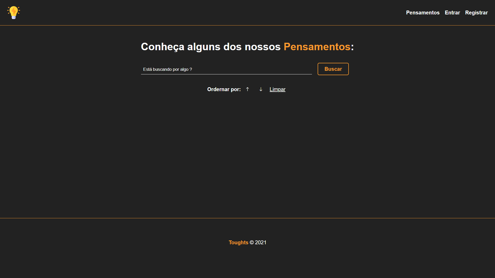
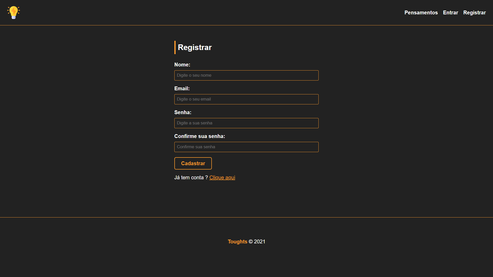
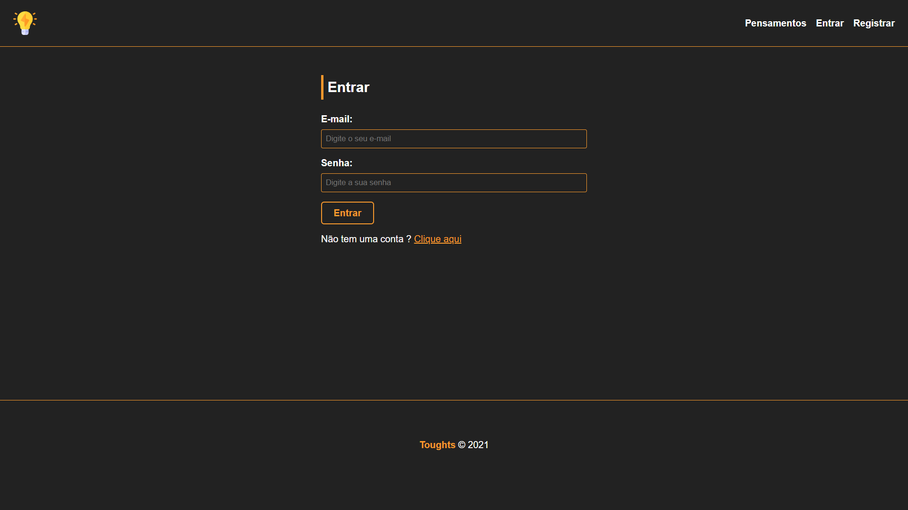
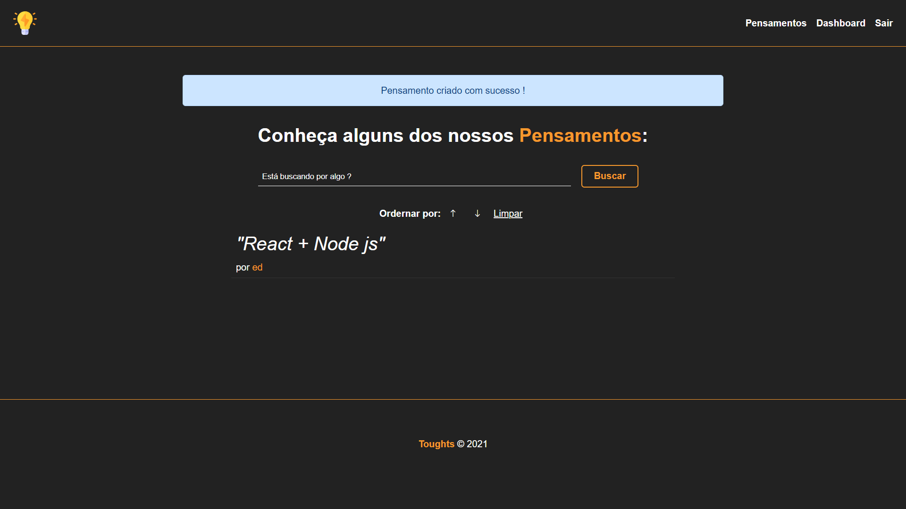

# Toughts

# Imagens do projeto

  
  
  
  

# Sobre este  projeto
A ideia do App é:

"É um sistema que tem o usuário e seus pensamentos, como se fosse um blog e cada um pode olhas os pensamentos dos outros usários."

# Algumas informações sobre esta API

1 - Aplicação nodejs com estrutura MVC.

# Funcionalidades

* Criar usuário.
* Criar pensamento.
* Olha pensamentos dos outros usuários e seu pensamentos.
* Realizar pesquisas e filtros.

# Construido com:
* Bcryptjs - Para criptografia.
* Mysql - Rodei um banco de dados local utilizando Xampp, essa aplicação teve uso de dados relacionados com chave estrangeira.
* Sequelize - ORM para manipular mysql.
* connect-flash, cookie-parser, cookie-session, express-flash, express-session - Para criar sessão e as mensagens do sistema.
* Handlebars - Para criar as views do sistema.
* Eslint e Prettier - Para manter um código limpo
